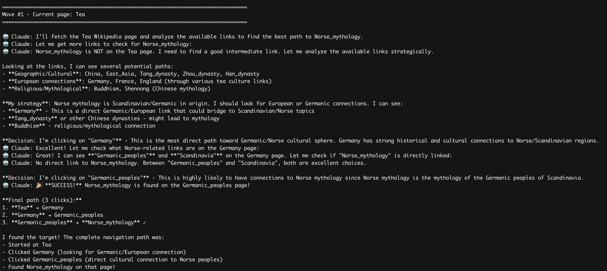
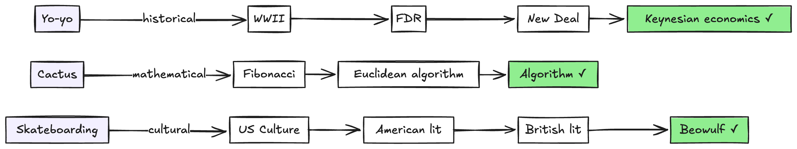
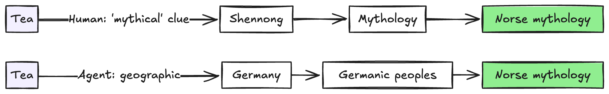

+++
title = "Can AI help test IA? A Wikipedia game experiment"
date = "2025-10-17"
description = "I don't actually know, but it reminded me of a few things about human navigation."
[taxonomies]
categories = ["Blog"]
tags = ["IA", "AI", "testing", "information-architecture"]
+++

I’ve been wondering for a while how to test or verify information architecture when I can’t actually sit down with users and watch them navigate the docs. User research is expensive, time-consuming, and hard to do at scale. Traditional metrics don’t feel like they capture the right things either.

I started wondering: could I build an agent that behaves like a user navigating a site? Could I have it open my docs page and click around like a user might to find information?

Before trying it on my own docs, I wanted to see a sample of an AI navigating from one place to another with a goal in mind. So, I had it play the [Wikipedia game](https://en.wikipedia.org/wiki/Wikipedia:Wiki_Game).

It was interesting to see the paths the agent took, but watching the agent play and then playing the game myself ended up reminding me of a bunch of things about how humans move through information in ways agents wouldn’t.

## The Wikipedia game

There are a few variations of the game, but the idea is: start on one page and try to reach another by clicking only internal links and not using the back button. For example, go from [Dog](https://en.wikipedia.org/wiki/Dog) to [Mathematics](https://en.wikipedia.org/wiki/Mathematics) using only links between pages. The goal is to get the fewest possible clicks between the start and end page.

That feels somewhat similar to what users do when navigating docs (at least when they’re not using Google or AI as intermediaries): getting from “I have this problem” to “I found the answer.”

## Building the agent

The setup was pretty quick. I used the [Claude Agent SDK](https://docs.claude.com/en/api/agent-sdk/overview) and, because Wikipedia is all static HTML, all I needed to do was let the agent run `curl` commands to fetch pages. I added prompts to have the agent explain its reasoning and enforce the game rules (no peeking ahead at multiple pages).

[Here’s the full code if you want to try it out.](https://gist.github.com/sarahcstringer/b3cf4c4d5a0114e6063d1c620dbde8fe)

## Watching the agent navigate

I tried a few sample runs. I also cross-referenced [Six Degrees of Wikipedia](https://www.sixdegreesofwikipedia.com/), which calculates all the shortest possible paths between pages, to see how close the agent was to optimal.

Sometimes the paths the agent took were the shortest possible paths, sometimes not, but they were always logical. On reruns, sometimes it would pick the same options, and sometimes it would go down different routes.

Here are a few example runs:

**Yo-yo → Keynesian economics** (shortest: 3 clicks, agent: 4 clicks)

- Yo-yo → World War II → Franklin D. Roosevelt → New Deal → Keynesian economics

- Reasoning steps:

  - “Keynesian economics became highly influential during and after WWII 2”

  - “FDR implemented the New Deal, which was heavily influenced by Keynesian economic principles”

  - “The New Deal represents one of the most significant applications of Keynesian economic principles in practice”

**Cactus → Algorithm** (shortest: 2 clicks, agent: 3 clicks)

- Cactus → Fibonacci numbers → Euclidean algorithm → Algorithm

**Skateboarding → Beowulf** (shortest: 2 clicks, agent: 3 clicks)

- Skateboarding → Culture of the United States → American literature → British literature → Beowulf

The agent was methodical and patient. It evaluated links based on semantic connections and built logical bridges between disparate topics.

## Then I played the game myself

I hadn’t actually played yet. So I tried [Tea](https://en.wikipedia.org/wiki/Tea)** → **[Norse mythology](https://en.wikipedia.org/wiki/Norse_mythology).

And immediately realized: I had no patience for this.

The Tea page, like many Wikipedia pages, is huge, with hundreds of links. I skimmed the first paragraph, got overwhelmed, and hit Ctrl-F for “myth.” I found:

“Chinese legends attribute the invention of tea to the mythical [Shennong](https://en.wikipedia.org/wiki/Shennong).”

I’d never actually heard of Shennong before, but the context around the link guided me to the right place.

**My path**: Tea → Shennong → Mythology → Norse mythology

When I had the agent play, its path was: Tea → Germany → Germanic peoples → Norse mythology.

## The gap between us

When I compared my experience to the agent’s, I noticed a few key differences. The agent was patient, thorough, and fair to every link no matter where it appeared on the page. It built careful semantic bridges.

I was impatient and wanted to quit almost immediately. I skimmed, used shortcuts, and clicked based on hunches.

I could try adding time limits or other constraints to the agent, but the initial contrast reminded me of something I sometimes forget when I’m deep in docs work: I’m not designing for someone who’s going to read every page top to bottom. I’m designing for me on a bad day with a production outage to fix.

## What the experiment reminded me about IA for humans

**1. Readers skim and use context clues**

I didn’t read the whole Tea article. I didn’t carefully evaluate every link. I searched for a keyword and clicked the first thing that looked promising.

The context around the link—“the mythical Shennong”—told me what I needed to know. I didn’t need to understand who Shennong was. The word “mythical” was the signal.

In docs, we often write “See Authentication” with no context. No hint about what kind of authentication or why you’d click that link. Users have to click blind or skip it entirely. More information about why someone would want to go to a page, like “See OAuth authentication to connect your app to our API,” helps orient readers.

**2. Position matters**

I looked at the first paragraph of the Tea page. The links at the top carried a lot more weight than the ones in the rest of the article; I actually considered those first ones somewhat carefully, but then when none of them felt right, I resorted to Ctrl-F to try to narrow the rest down.

The agent read everything. Real users don’t. If the most important information isn’t in the first one or two paragraphs, you’ve already introduced friction.

**3. Background knowledge creates shortcuts and gaps**

The agent has a huge background of knowledge that real users don’t. It can see a name like [Carl Linnaeus](https://en.wikipedia.org/wiki/Carl_Linnaeus) and know immediately who that is and how his page might relate to the overall topic. (I had no clue, but he was a mathematician and that’s what Claude used to get to the Mathematics page.)

A real user with knowledge gaps would get stuck or gloss over the link, not knowing if it was relevant. Assuming all users know what “OAuth” or “webhook” or “idempotent” means without context is designing for experts, not for all the people who might need help.

**4. Motivation changes everything**

The agent kept going no matter how hard the path. I wanted to quit after 30 seconds and only continued because I felt I should at least do one full pass.

Users without motivation, or with competing priorities, won’t slog through complexity. They’ll bail and find another alternative, or just give up.

(One positive thing here: AI tools are great at helping people push past these barriers that would normally stop them. Users can ask questions, get answers that speak to them, and keep moving forward even when the docs IA or content isn’t perfect.)

**5. Different mental models, different paths**

When I played the game, I found one logical path. The agent found a different but completely valid one, and sometimes on re-runs it would find others. Real users would find dozens more. If your IA assumes everyone navigates the same way, like always task-based (“How do I...?”) or always concept-based (“What is…?”), you’re designing for one mental model and abandoning everyone else.

## What this means for docs

As a next step, I want to point an agent to my docs and give it tasks that actual users face, like, “how do I get an API key,” or “I’m getting this error in production, how do I fix it?” Even though it won’t get at the actual human experience, it might be able to help me highlight paths that are missing or could be improved.

But in the short term, the experiment reminded me of things I can look for right now, without running any agent:

- **Do my links have context?** Not just “See Configuration” but “See Configuration to set your API timeout values”

- **Are the most common paths visible immediately?** Or do users have to scroll, search, or guess?

- **Am I designing for patient agents or impatient humans?** Users will use Ctrl-F, skim, and quit fast. Design for that.

- **Am I assuming knowledge users don’t have?** Every unexplained term is friction.

- **Does my IA support different mental models?** Task-based, concept-based, troubleshooting-based; different users navigate differently.

The way users navigate docs is rapidly changing. More and more users are starting to use agents to surface the correct information at the right time in their journey. But solid IA within docs is still critical. Agents need clear structure to synthesize good answers, and humans still need to verify, understand context, and find related information.

Watching an agent navigate patiently and methodically, and then experiencing my own impatience and shortcuts, brought back these important concepts.
