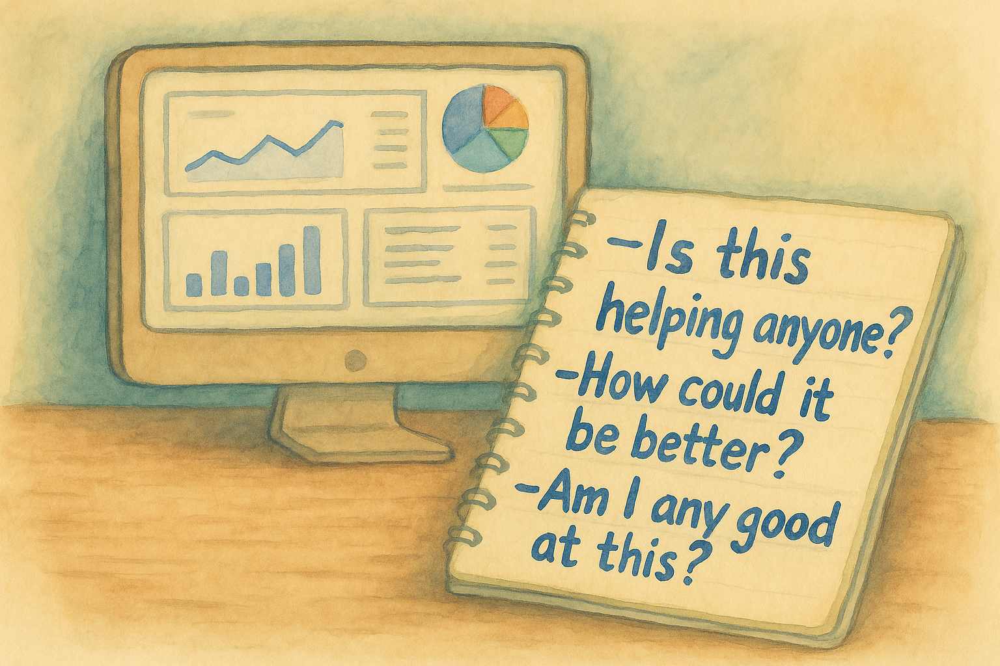
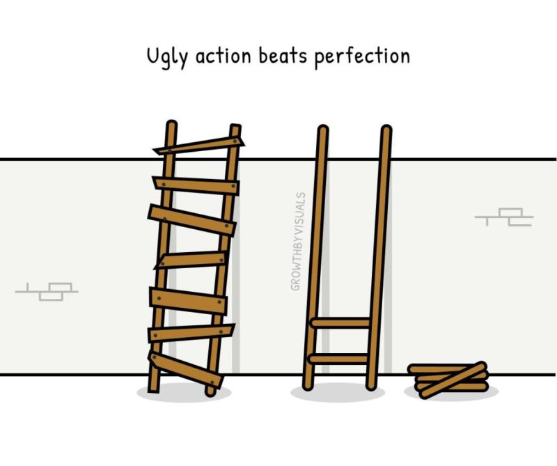

+++
title = "Docs metrics and the stories we tell ourselves"
date = "2025-09-23"
description = "My roles prior to developer education were in site reliability and infrastructure."
[taxonomies]
categories = ["Blog"]
tags = ["documentation", "metrics", "measurement", "developer-education"]
+++

My roles prior to developer education were in site reliability and infrastructure. When I joined my first docs team, I immediately asked where our dashboards lived. The answer: *“There's an old Looker Studio dashboard pulling from Excel sheets that's been broken for a few months.”*

In SRE, observability was everything. I could see at any given time how the system was performing, and when I fixed something, I could immediately see it. I could dive into a flame graph or a trace, identify a bottleneck, apply a fix, and see the metrics move. Instant, concrete feedback.

Docs metrics are not like that.

## The metrics gap

I fixed the broken docs dashboard, excited for numbers to roll in and describe our documentation system. I started seeing page views, user comments, geographic information from users, time on page. For a while, I thought we were in business.

But then: nothing. No one made decisions from the data. No one even looked at the charts now that they were fixed. And slowly I realized that the numbers I was tracking didn't actually answer the questions I had.

Leadership leaned on traditional top-of-funnel metrics like pageviews and traffic sources to quantify docs’ contribution to pipeline. Meanwhile, ICs wanted to know: Are the docs actually helping? Are users able to find what they need? Where are people getting lost or dropping off? Those are the answers that would let us improve the docs, but they're harder to measure.

I do understand the value in some of those traditional metrics. They can help justify new headcount, guide prioritization, or demonstrate business impact when you need to make a case for resources. They have their place. But they don’t answer the questions that keep driving me.

I started looking for new metrics that would give me a better understanding of our docs system. I read books, listened to podcasts, watched conference talks. And I always felt dissatisfied with the answers I received.

Really, what I want most to know is:

- Is this helping anyone?

- How could it be better?

- Am I any good at this?

Eventually, I stopped looking for answers. According to the [2025 State of Docs report](https://www.stateofdocs.com/2025/), 39% of docs teams don't measure anything at all. For a while, I’ve been one of them.

But that doesn’t feel right either. In chasing the answers I wanted as an IC, I stopped measuring altogether, and in doing so, I dropped signals that could still be useful for the team and for leadership.

## Numbers and the stories we tell ourselves

A friend in Business Intelligence once told me his role was to be *“less and less wrong each day.”*

That line stuck with me. In messy human systems, metrics aren't truth.

Take exit pages or bounce rate: in marketing, high exit and bounce is always bad. In docs, it could mean a user gave up in frustration, or that they found their answer and left satisfied. Same number, opposite stories.

The data we do have is incomplete: scattered across tools, missing offline use, blocked by cookies, and now distorted by AI as more people pull answers from assistants instead of visiting the docs.

The numbers don't decide for us. They only frame possibilities. It's up to us to interpret, connect, and tell the story. Who knows if that story is the right one? We’re just trying to inch towards some truth.

I once heard a talk from someone who built dashboards for pro League of Legends players, and he said one of his biggest takeaways was that the teams were much less data driven than they thought. They used intuition first, then used data to back up their story. I think that’s often how docs metrics end up working too.

## What I'm actually going to do

For a while, I let the lack of perfect measures paralyze me. I wanted the clean dashboard, the SRE-style flame graph of docs. But chasing perfect meant I wasn't measuring anything at all. My manager had little way to demonstrate my work beyond anecdotes, and I had no way to point to trends, prioritize projects, or make the case for what needed attention.

Then I saw this image and it really hit me: the crooked ladder still gets you where you need to go.

So I decided to build my own imperfect ladder using tools I'd overlooked or dismissed before. 

[Sarah Moir’s](https://thisisimportant.net/) work on docs analytics has been grounding here. Her conclusion in her post [“Where to start with analytics for documentation](https://thisisimportant.net/posts/documentation-site-analytics-start/)[**”**](https://thisisimportant.net/posts/documentation-site-analytics-start/) really resonates: *“Analytics are intimidating, but remember, they’re fuzzy too. Fuzzy and imperfect proxies for what we really want to know: Is our documentation helping?”*

Instead of chasing one comprehensive solution, I'm taking an incremental approach: starting with basics I'd written off as insufficient, then building up as I learn what actually matters.

### Step 1: Track what you can

The latest [State of Docs report](https://www.stateofdocs.com/2025/documentation-tooling-and-api-docs) shows that the most commonly tracked metrics are page views, user feedback widgets, internal search terms, and time on page. So here’s what I’m actually going to start with as my baseline:

- **Page views**: just to see what content gets the most traffic.

- **Helpful / not helpful votes**: at least a signal when something isn’t working for someone.

- **Internal search terms**: especially the ones that return no results, since that shows where the gaps are.

- **Time on page**: still ambiguous, but maybe useful if I can connect it to changes I make.

There are other numbers I’d like to chase down too, specifically time from signup to first API call, or to a certain level of spend. Those can be powerful indicators of activation and product adoption. But they only make sense in context: if a lot of onboarding is handled by Solutions Engineers or CSMs, the docs might play a smaller role. I can probably filter for self-service accounts to get a cleaner signal of how documentation influences those timelines.

### Step 2: Control what you can measure

While I can't sit next to users and hear what they think about our docs, I can define what quality means to me and track against it.

External metrics live with the user and are hard to measure directly. I can balance those with internal metrics where I create a checklist for quality I can control:

- Does the doc have troubleshooting steps and next steps?

- Is the code complete and copy-paste-ready?

- Is the language clear and consistent with our style guide?

- Is it written at the reading level we expect for all our docs?

- How many linting errors, warnings, and suggestions are there?

- When was the doc created and last updated?

These are metrics we can actually measure within our docs set. It’s not the same as knowing if the doc truly helped someone, but it gives me a baseline of quality I can control, and can give some sense of comfort that we’re at least meeting the quality benchmarks we’ve defined. It can also give us more information about which docs need attention, especially when paired with other site analytics.

### Step 3: Watch for new opportunities

I'm really intrigued by AI assistants. Han Wang from Mintlify [says 40% of users on their docs sites ask the assistant something before clicking around](https://www.linkedin.com/posts/handotdev_ai-is-forever-changing-the-way-developers-activity-7333193515427930113-VhCR?utm_source=share&utm_medium=member_desktop&rcm=ACoAAFh8ygIBAfV-RAKF0igXBOjbHH0H0vrpfrE). Lots of people are now navigating through an interface where they tell you exactly where they’re starting and what they want to know. You can even watch how they continue after being presented with information.

That feels like the closest thing to observability for docs I’ve seen. Context in the questions people ask, how they navigate, how we interpret the data itself.

I’m hopeful about this direction, but I’m also braced for disappointment. I’ve chased a lot of metrics that promised clarity and delivered noise.

### Step 4: Keep looking, keep learning

Finally, I’ll look at these metrics regularly. A few times a week, I’ll check the data, get a baseline, and start weaving a story from what’s there. The real commitment is to keep looking, comparing, and asking better questions.

On a small team, I’ve never really needed to justify my time with metrics. But I can see the business value in them: they give me a point of view I can share with leadership, a way to frame priorities, and a starting place for conversations about where docs fit into bigger goals.

## Conclusion

I may never get the beautiful, real-time, unified Grafana dashboard for my documentation that I crave. But I can still try to use what data we have to reduce uncertainty, guide decisions, create a shared vocabulary for talking about impact, and tell better stories about what’s working and what’s not.

I’m trying to embrace that the real work isn’t finding the one metric that says it all; it’s staying curious, asking better questions, and building a system that gets a little less wrong each day.
