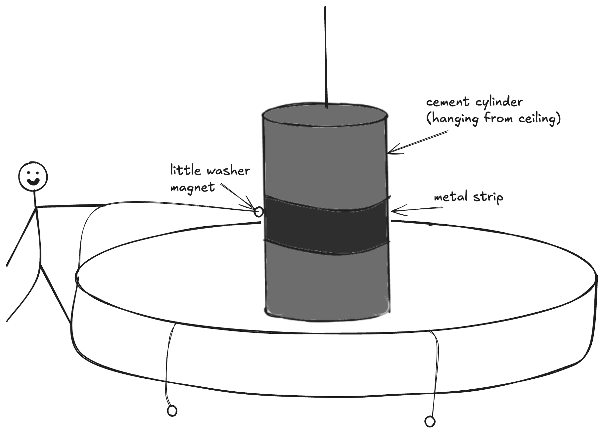

+++
title = "The Exploratorium boulder: why enthusiasm isn't always contagious"
date = "2025-10-10"
description = "Why enthusiasm for AI tools isn't always contagious, and what I learned about sharing new technologies with skeptical colleagues."

[taxonomies]
categories = ["Blog"]
tags = ["AI", "collaboration", "empathy", "change-management"]

[extra]
subtitle = "On becoming the colleague I used to roll my eyes at."
+++

Seven months ago, I was skeptical of AI. I had a colleague who was wild about it, constantly building AI tools that no one else on the team used. His enthusiasm actually made me less inclined to try it. I assumed I already knew what he was doing with AI without ever trying it myself.

Fast forward to the present day: I’m the enthusiastic one now. I’m all-in on Claude, Cursor, AI-assisted docs workflows, the whole thing. 

A few weeks ago, I sat down with another former colleague to show her what I’ve been using. We both worked with the same AI enthusiast colleague, and since leaving the team, I’d become super “AI pilled” while she hadn’t done much to adopt it. So, I thought I’d show her what was actually working for me and how things had changed.

I asked if she was working in docs-as-code. She wasn’t.

“Ah, okay,” I said. “So none of these things will really work for you.”

And then I proceeded to show her all of them anyway.

There were a few things she could use, like Claude for drafting or asking questions. But while I was talking, I kept feeling like I wasn’t making any headway. She was polite but not convinced. 

And then I realized that I was doing exactly what my old colleague had done to me.

I was showing her the tools that worked for me, in my workflow, without understanding where AI would actually make sense for her. I never asked what her pain points were. I never asked what she loved or hated about her current process. I just demoed a bunch of stuff that didn’t fit her world.

For example: I love using AI to generate a messy first draft that I can shape and refine. But maybe that’s her favorite part of writing. Maybe what annoys her is something totally different, like formatting, research, or keeping track of updates across multiple docs. I didn’t ask. I just showed off.

The Exploratorium boulderMy favorite exhibit at the [Exploratorium](https://www.exploratorium.edu/) when I was a kid was a massive cement cylinder hanging from the ceiling, surrounded by a circle of tiny magnets on strings. The cylinder had a strip of metal around it, and the goal was to throw your magnet onto the metal, connect it, and then pull the boulder in your direction.

If you pulled hard, the magnet immediately detached. You got nowhere.

The key was to connect the magnet and then do the tiniest possible pull. Not even a pull; more like a whisper of movement. Slowly, gently, your pulls can get stronger and the whole boulder starts swinging your way.

I loved watching kids yank the magnets over and over and then give up. Then I’d sneak in, knowing the secret. Throw the magnet, barely touch the string, and do the gentlest tug. It felt like I could speak its language, like I was working with the cylinder instead of fighting it.

(As an adult I realize there was probably a poster right next to the exhibit explaining exactly how it worked and what to do, but still, it felt like a secret.)

Over the years, I found myself remembering this experiment in other contexts, especially psychology and human interactions. You can’t yank someone to your perspective immediately. You have to meet them where they are, truly understand where they’re coming from, and move from there, together.

Learning AI and the 10 hour rule The same feels true for AI adoption: you have to try it yourself to find what works for your flow.

Ethan Mollick suggests that you need to spend about [10 hours just using AI](https://www.oneusefulthing.org/p/thinking-like-an-ai) for work or fun to really understand it.

For about 10 hours, just do stuff with AI that you do for work or fun. Poke it, prod it, ask it weird questions. See where it shines and where it stumbles. Your hands-on experience will teach you more than any article ever could (even this long one). You’ll figure out a remarkable amount about how to use AI effectively, and you might even surprise yourself with what you discover.

Somewhere in those 10 hours, most people hit a moment where something just clicks. But even tech writers on the same team aren’t going to have the same *aha* moments.

My first win with AI was realizing Claude could generate a diagram for me in 30 seconds that would’ve taken me 20 minutes in Lucidchart. That tiny win opened the door for everything else. But someone else might not care about diagrams at all. Maybe their moment is rewriting a dense paragraph, generating test data, or summarizing a long Slack thread.

You can’t shortcut someone else’s discovery process. You can’t demo them into belief.

What I should have doneInstead of showing my workflow, I should have suggested we sit down and work together.

I should have asked:

- What are you working on right now?

- What’s annoying you about it?

- Want to try throwing this problem at Claude and see what happens?

And then we could have experimented together. Maybe it would’ve worked, maybe it wouldn’t. But at least we’d be starting from *her* reality, not mine.

Late in our conversation, she mentioned she was trying to build an agent and struggling to craft the right prompt for it. I said, “Oh, I’d just ask Claude to help me write the prompt for the agent.” That seemed to land. Not because it was the coolest AI trick I showed her, but because it directly addressed a problem she was facing right then.

That was the magnet connection. Not “here’s all the ways I use AI,” but “here’s one small thing that solves your actual problem today.”

I think this approach is especially important for skeptical folks. Once you’re already onboard with AI, sure, demos are great. But if you’re still unsure? A demo just feels like someone showing off. A working session feels like collaboration.

The irony is that I needed someone to meet me where I was seven months ago. I wasn’t ready for “here’s my whole AI-powered setup.” I needed someone to say, “What’s annoying you right now? Let’s try one small thing together and see if it helps.” And really, I just needed space and tooling to poke and play.

Meeting people in their worldWhen we throw out our most brilliant, complex use cases through demos, that’s not where the magic happens for most people. The transformative moments aren’t in the flashy stuff. Instead, they’re in the mundane examples that meet people in their real struggles. The meeting notes summarizer that means you’re not missing anything important. The health transcript note taker that saves nurses from burnout. The prompt helper that unsticks you when you’re building something.

Ethan Mollick has also made this point often: focusing only on “transformational” use cases obscures the fact that small, meaningful ones are already changing work in quiet ways. [He jokes](https://www.linkedin.com/posts/emollick_you-will-know-the-big-ai-labs-get-the-actual-activity-7381005393591689218-f0Y_?utm_source=share&utm_medium=member_desktop&rcm=ACoAAFh8ygIBAfV-RAKF0igXBOjbHH0H0vrpfrE) that we’ll know the big AI labs finally get it when they stop having “Dev Day” and start having “Non-Technical Manager Day.”

The whisper, not the yankWhen I’m excited, I lead with my favorite, most impressive workflows. But those aren’t anyone else’s entry points. They’re the things I love because I’ve already done my 10 hours and discovered what fits my workflow.

If you’re excited about AI (or any tool, really), it’s tempting to show people everything you’ve figured out. But excitement isn’t always contagious. Sometimes it’s overwhelming.

So here’s what I’m trying to remember: ask first. Listen. Find the tiny magnet connection point. Then whisper.

The boulder will start moving with you, together.
