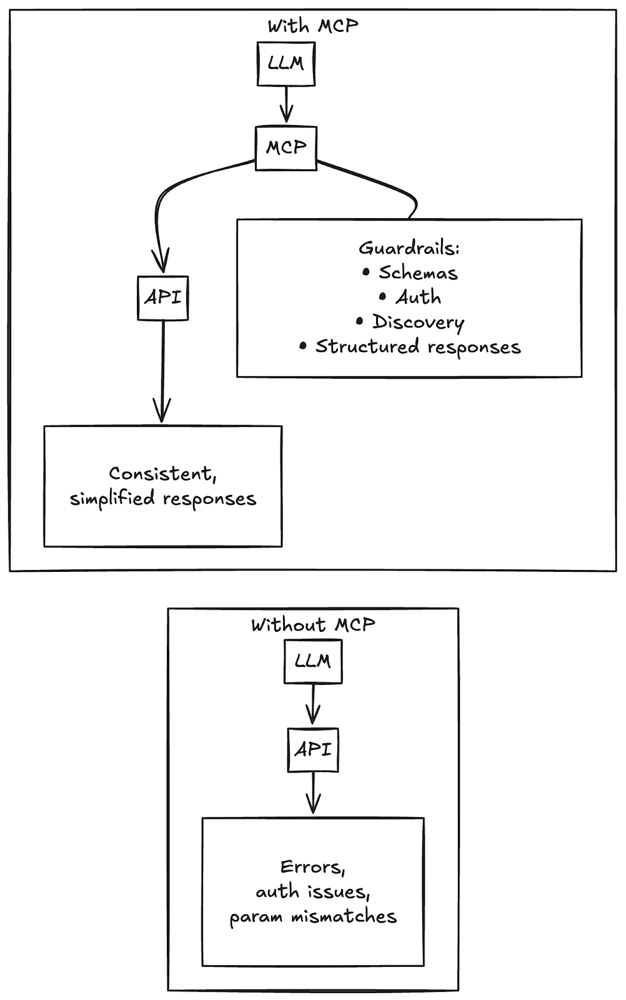
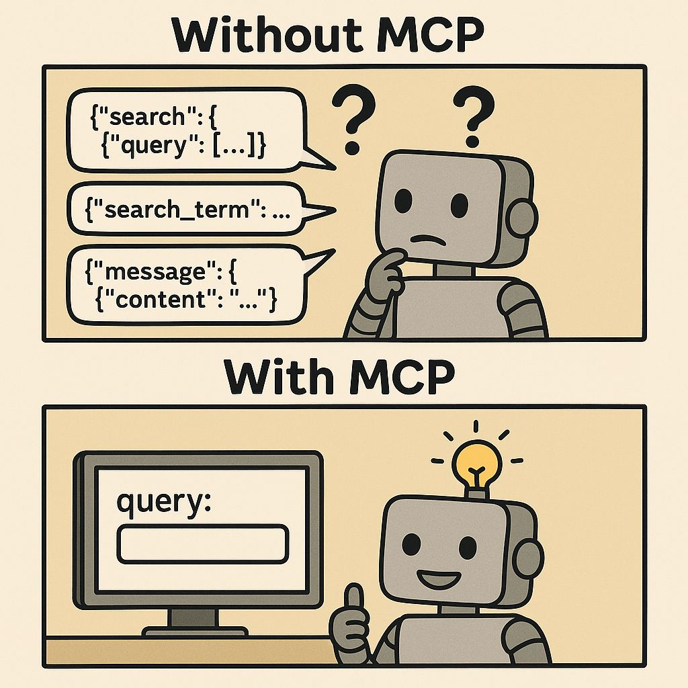

+++
title = "Learn MCP with me, part 1: what is this even for?"
date = "2025-09-08"
description = "Because LLMs can't stop hallucinating parameter names."
[taxonomies]
categories = ["Blog"]
tags = ["MCP", "AI", "APIs", "protocols"]
+++

I wrote this post because I found myself struggling with a very specific question: Why MCP when we already have APIs and so many ways to communicate programmatically?

**TL;DR:** MCP isn't replacing APIs; it's a guardrail layer that makes LLMs less terrible at using them.

## Why MCP when we already have APIs?

I come from an API development background: I'm comfortable working with, writing, and documenting APIs. Since MCP came out, I've been side-eyeing it like, "mhmm, yes I get it, it’s just another API.”

But when I started to dig in, I couldn’t get past the question: what problem does this solve that REST + OpenAPI don’t already cover?

We've already solved "connect different systems" multiple times. We’ve got REST, GraphQL, gRPC, even SOAP, and so many others. And then MCP shows up in 2024 saying "Here's a standardized way for AI to connect to external tools." What problem is it solving that REST + OpenAPI doesn't already solve? It felt like the [XKCD comic](https://xkcd.com/927/).

## The answer: LLMs suck at using APIs

After reading more, here's what I found: LLMs are terrible API clients. They hallucinate parameter names, mishandle nested responses, and struggle with authentication patterns.

Chatting with an LLM can sometimes feel so magical that I forget they’re all just probabilistic token generators. They’re not reading the OpenAPI spec or docs and using logic and reasoning to determine the correct API response. They’re coming up with the most common patterns they’ve seen in training, and sometimes those aren’t actually correct.

## How MCP fixes this

MCP doesn't replace APIs. It inserts a competency layer between LLMs and APIs. Here’s what it adds:

- **Standardized tool interface**: LLM just fills in parameters, no guessing endpoint names or auth headers.

- **Clean, structured responses**: Instead of wrestling with 50-field JSON objects, the LLM gets simplified outputs.

- **Authentication abstraction**: Tokens, OAuth, headers are all handled server-side, so the LLM doesn’t need to deal with any of that, it just needs to be handed the correct keys.

- **Discovery built-in**: The LLM can ask "What tools are available?" rather than needing a preloaded spec.

Instead of fragile API calls, the LLM gets a structured template it just fills in. It gets information back in a reliable, standardized way. It doesn’t have to guess that a GitHub API needs `repository_name` vs. `repo_name`; MCP ensures it always gets the right parameter structure. Then you can plug that into agents or tools like Cursor or Claude so they can interact with those systems.

### Follow up: I’m still confused

I still had a few questions. Mainly, if an LLM can’t just look at an OpenAPI spec and get it right, why would it magically succeed with MCP?

The key is that MCP doesn’t rely on the model *parsing and reasoning* over a giant spec. Instead, the MCP runtime hands the LLM a structured template for each tool, enforces the parameters, and validates the output. The model isn’t “learning MCP” from training. It’s just filling in blanks inside a schema the runtime controls. That shift from “read this 50-page manual and hope you guess correctly” to “fill out this form, we’ll handle the rest” is what makes MCP reliably work where OpenAPI falls apart.

## When you would want to use MCP

One of the biggest errors I’ve seen with people using AI is overengineering a solution. Sometimes it’s going to be a lot more reliable and straightforward to just integrate with one API than add a bunch of MCP servers.

That said, there are definitely cases when MCP is the right choice:

- **AI agents that adapt**: a code review assistant that chooses tools based on changed files.

- **Chat interfaces with tool access**: asking "Any errors in the auth module?" and having the LLM query Sentry + GitHub automatically.

- **Cross-system workflows**: coordinating multiple tools without manually programming the details for each one.

The cross-systems workflows use case is where it gets exciting: the ability to coordinate across multiple systems without hardcoding every single step yourself.

Imagine an AI assistant helping with customer support triage. It could:

• Pull recent Zendesk tickets that mention a specific issue

• Cross-reference related documentation in Confluence or issues in Jira

• Post a suggested reply draft in Slack for a support agent to review

With APIs, you’d have to write and maintain that integration flow. With MCP, the agent can discover tools at runtime and decide which to call, in what order. It’s less “pre-baked script” and more “AI reasoning with a toolkit.”

That’s MCP’s sweet spot: enabling adaptive orchestration across services.

## When you don't need MCP

There are many cases when MCP and even agentic AI is overkill:

- You're building deterministic workflows (cron jobs, fixed reports)

- You're writing code yourself (you don't need a middleman)

- It's a single integration (REST is simpler)

- You need full debugging control (direct API calls are transparent)

## The bottom line

MCP isn't a revolution. It's an evolution. It wraps existing API practices in guardrails so LLMs can use them without faceplanting. But, it’s still pretty exciting when you start working with it and seeing how quickly you can add integrations into an AI app. 

Now that I’m convinced MCP is worthwhile, I’ll dig into how to actually connect to MCP servers. That’s coming soon.
