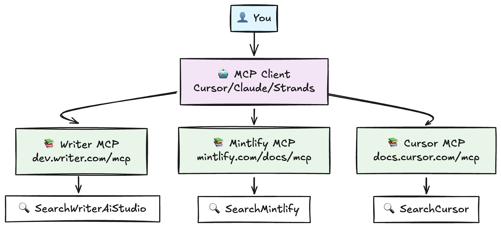
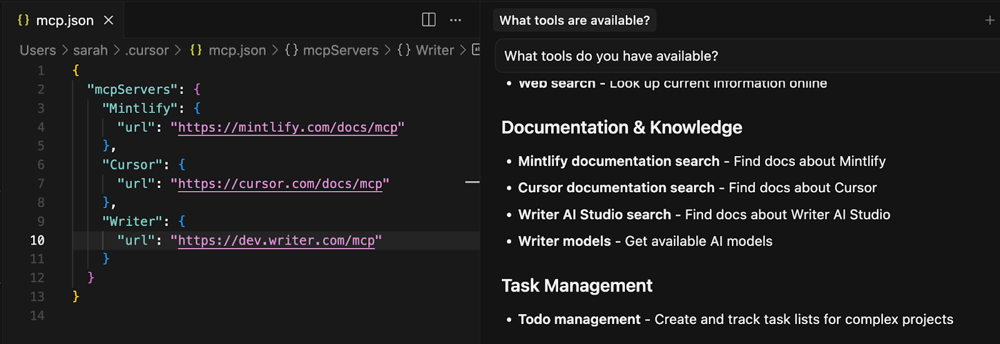
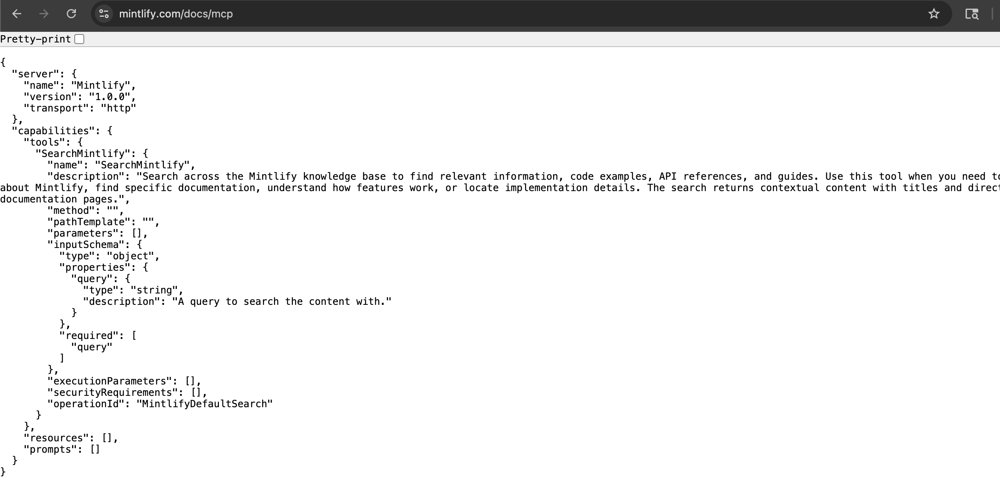
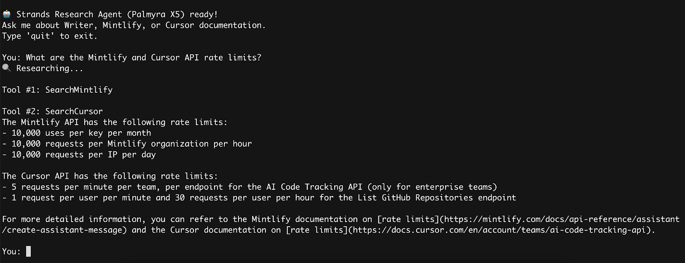
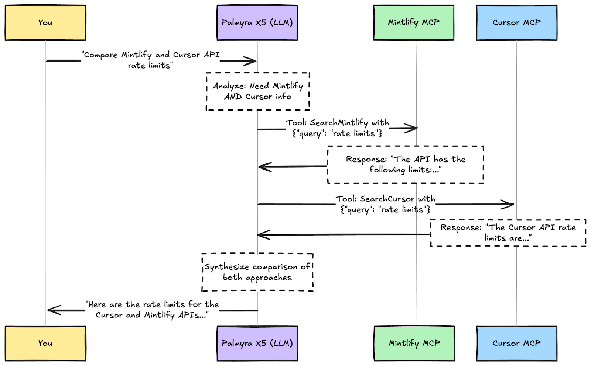

+++
title = "Learn MCP with me, part 2: working with MCP servers and clients"
date = "2025-09-10"
description = "Okay, I'm actually excited about MCP now."
[taxonomies]
categories = ["Blog"]
tags = ["MCP", "AI", "documentation", "agents"]
+++

In [Part 1](https://substack.com/home/post/p-173130074), I looked into *why* MCP exists: it's guardrails for LLMs to use APIs without screwing up. Next I wanted to dig into how to actually work with MCP servers.

What got me started on this journey was discovering that [Mintlify offers MCP servers](https://mintlify.com/blog/generate-mcp-servers-for-your-docs) for all their hosted documentation sites. I saw this but didn't really understand what it meant or how to use it. Can I curl an MCP server? How do I debug when things go wrong? What does the development workflow actually look like?

I decided to explore using some of these Mintlify-hosted MCP servers to build a documentation research agent that will provide answers across several different tools I use.

I went into this just trying to learn the technical details, but I walked away genuinely excited. Even though I knew theoretically what MCP should do, watching an agent I created intelligently decide "I need to search Mintlify docs AND Cursor docs for this comparison question" and then synthesize the results was pretty magical.

## Quick review: clients vs. servers

To quickly recap:

**MCP server**: exposes tools/resources that an AI can use. In this case, I’m using remote-hosted MCP servers that Mintlify sets up for docs sites. [There’s a large list of other MCP servers here](https://www.pulsemcp.com/servers).

**MCP client**: the AI application that connects to and uses MCP servers (like Claude Desktop, Cursor, Windsurf, or one you build yourself).

You configure the client to know about servers, then ask the AI to do things, and it figures out which tools to use.

## 1. Just get it working: plug into an AI app

This is probably the best way to get moving. Here, I'll use Cursor as an example, but the same approach works with Claude Desktop or other AI clients. I wanted to use remote servers to test this because I didn’t want to focus on setting up local servers.

**Setup for Cursor:**

1. Create an `mcp.json` file in Cursor. [This can be project-specific or global](https://docs.cursor.com/en/context/mcp#configuration-locations). Cursor also has some [one-click integrations listed](https://docs.cursor.com/en/context/mcp) so you don’t even need to manually update a file.

1. Add the remote URL for any MCP servers

1. Ask the AI to do things

Here's my `~/.cursor/mcp.json`, which connects to three different MCP servers that contain docs for the different tools I use (WRITER, Mintlify, and Cursor):

`{
  "mcpServers": {
    "Writer Docs": {
      "url": "https://dev.writer.com/mcp"
    },
    "Mintlify": {
      "url": "https://www.mintlify.com/docs/mcp"
    },
    "Cursor": {
      "url": "https://docs.cursor.com/mcp"
    }
  }
}`You can verify these URLs work by visiting them in your browser. They should return JSON describing the server capabilities.

### Try it out

I was initially confused about what to do next. How do you test it? How do you know it's working? It’s actually a lot simpler than I was making it in my head.

Once you add your servers to Cursor, it's just a regular chat. MCP servers are essentially just tools your AI can use. It’s like any other function you might give an AI, like one that calculates averages or fetches weather data.

**The magic happens in conversation:**

- Ask: "What tools do you have available?"

- *The AI shows you what it can access across all your tool documentation*

- Ask: "How do I implement authentication across Writer, Mintlify, and Cursor?"

- *The AI searches each documentation server and synthesizes the results*

- Ask: "What are the API rate limits for each of these tools?"

- *The AI compares approaches across all three platforms*

At this point, you might be satisfied. It works, it's useful, and you don't need to understand the details. But I was still trying to figure out what was actually happening under the hood.

## 2. What's actually going on? Taking a look with curl

My first instinct was: "Can I just curl this thing?" I was still confused about transport and protocols and what’s actually happening for the request/response pattern. So tried it out.

### Server inspection

If you visit `https://www.mintlify.com/docs/mcp` in a browser, you can see the server capabilities. It shows you the available tools, their descriptions, and parameter schemas, similar to an OpenAPI spec.

But can I actually call the tools with familiar HTTP tools?

### Calling tools with curl

This is where I learned MCP isn't just REST with a different name. It uses [JSON-RPC 2.0](https://www.jsonrpc.org/specification), which requires a more structured approach.

After some trial and error and checking out the[ MCP specification](https://github.com/modelcontextprotocol/modelcontextprotocol/blob/main/schema/2025-06-18/schema.ts), here's what works:

First, you need to initialize a connection and send an initialize request using `jsonrpc 2.0`. This [initialize method is from the MCP](https://github.com/modelcontextprotocol/modelcontextprotocol/blob/main/schema/2025-06-18/schema.ts#L172) spec, so it’s standard for all MCP requests.

`# 1. Initialize the connection
curl -X POST "https://www.mintlify.com/docs/mcp" \
  -H "Content-Type: application/json" \
  -H "Accept: application/json, text/event-stream" \
  -d '{
    "jsonrpc": "2.0",
    "id": 1,
    "method": "initialize",
    "params": {
      "protocolVersion": "1.0",
      "capabilities": {},
      "clientInfo": {"name": "test-client", "version": "0.1"}
    }
  }'`Success! It returns [Server-Sent Events](https://developer.mozilla.org/en-US/docs/Web/API/Server-sent_events/Using_server-sent_events) with the actual available tools:

`event: message
data: {"result":{"protocolVersion":"2025-06-18","capabilities":{"tools":{"SearchMintlify":{"name":"SearchMintlify","description":"Search across the Mintlify knowledge base to find relevant information...","method":"","pathTemplate":"","parameters":[],"inputSchema":{"type":"object","properties":{"query":{"type":"string","description":"A query to search the content with."}},"required":["query"]},"executionParameters":[],"securityRequirements":[],"operationId":"MintlifyDefaultSearch"},"listChanged":true}},"serverInfo":{"name":"Mintlify","version":"1.0.0"}},"jsonrpc":"2.0","id":1}`Then, you can call a tool. You can see in the response above that there’s a tool called `SearchMintlify` that takes a required query argument.

The `tools/call` method is [specifically defined within the MCP spec as well](https://github.com/modelcontextprotocol/modelcontextprotocol/blob/main/schema/2025-06-18/schema.ts#L172). The LLM can see from this tools list what it needs to plug in to provide when it calls the tool.

`# 2. Call a tool (note the exact tool name from the capabilities response)
curl -X POST "https://www.mintlify.com/docs/mcp" \
  -H "Content-Type: application/json" \
  -H "Accept: application/json, text/event-stream" \
  -d '{
    "jsonrpc": "2.0",
    "id": 2,
    "method": "tools/call",
    "params": {
      "name": "SearchMintlify",
      "arguments": {"query": "API authentication"}
    }
  }'`And when it works, you get back:

`event: message
data: {"result":{"content":[{"type":"text","text":"Title: Authentication\nLink: https://www.mintlify.com/docs/api-playground/mdx/authentication\nContent: You can set authentication parameters to let users use their real API keys..."}]}}`
### Here’s what the full flow looks like:

This was really helpful for me to understand what was part of the MCP spec and what’s happening when an agent uses an MCP tool. I wouldn’t use curl when implementing an MCP client, but it’s useful if you want to:

- Verify server availability and capabilities

- Test the initialization handshake

- Debug tool calls and see exact response formats

- Understand authentication requirements

To actually build a client, you'd want a client library.

## 3. Building it myself: an intelligent docs support agent

Now that I understand the protocol better, I wanted to try to build my own agent that could work with these MCP servers.

### Using Amazon Strands with built-in MCP support

I chose to use Amazon [Strands](https://strandsagents.com/latest/) for this part, because I like the interface, it has integrations with [WRITER](https://strandsagents.com/latest/documentation/docs/user-guide/concepts/model-providers/writer) and lots of other model providers, and it happens to have MCP support built in.

With Strands, you can swap out WRITER models for other model providers if you use something else, like Anthropic or OpenAI.

To follow along, first you’d install Strands with Writer (or your model provider, you can [find the info in the Strands docs](https://strandsagents.com/latest/documentation/docs/user-guide/concepts/model-providers/amazon-bedrock/)) and tool support:

`pip install 'strands-agents[writer]' strands-agents-tools`You’d also need an API key for the model provider you’re using.

Below I’ll walk through the agent I built to answer questions about the three different tools I'm using by pulling from their docs MCP servers. It creates connections to multiple MCP servers, combines all their tools, and lets the AI agent decide which ones to use for each question.[ See the full code in this Gist.](https://gist.github.com/sarahcstringer/9d07e30fb3a4a6e2b5474266852284a6)

First, import the dependencies.

`import os

from mcp.client.streamable_http import streamablehttp_client
from strands import Agent
from strands.models.writer import WriterModel
from strands.tools.mcp import MCPClient`The next section configures the Strands Agent. It creates streamable http connections to the three servers, configures the model to use [Palmyra X5](https://www.google.com/search?q=palmyra+x5&oq=palmyra+x5&gs_lcrp=EgZjaHJvbWUyCQgAEEUYORiABDIHCAEQABiABDIHCAIQABiABDIHCAMQABiABDIICAQQABgWGB4yCAgFEAAYFhgeMggIBhAAGBYYHjIICAcQABgWGB4yCAgIEAAYFhgeMgcICRAAGO8F0gEIMTM4NWowajeoAgCwAgA&sourceid=chrome&ie=UTF-8), and stores the system prompt for the agent.

`class StrandsResearchAgent:
    def __init__(self):
        """Initialize MCP clients for documentation servers"""
        # Create MCP clients for each documentation server
        self.writer_client = MCPClient(
            lambda: streamablehttp_client("https://dev.writer.com/mcp")
        )
        self.mintlify_client = MCPClient(
            lambda: streamablehttp_client("https://www.mintlify.com/docs/mcp")
        )
        self.cursor_client = MCPClient(
            lambda: streamablehttp_client("https://docs.cursor.com/mcp")
        )

        # Set up Palmyra X5 model
        self.model = WriterModel(
            client_args={"api_key": os.getenv("WRITER_API_KEY")},
            model_id="palmyra-x5",
            temperature=0.3,  # Lower temperature for more focused responses
        )

        # System prompt
        self.system_prompt = """
        You are a research assistant with access to documentation from Writer, Mintlify, and Cursor.
        When answering questions:
        1. Determine which documentation sources are most relevant to the question
        2. Search those sources strategically (don't search everything unless necessary)
        3. Synthesize information from multiple sources when helpful
        4. Provide practical, actionable answers with examples when possible
        Be efficient with tool usage - only search the documentation that's relevant to the specific question.
        """`The script then starts the chat loop. It opens the connections to the MCP servers so they’re available during the context of the agent chat. Then it provides the list of all the available tools from the MCP clients to the agent, along with the model and system prompt defined earlier.

`    def chat_loop(self):
        """Interactive chat loop for research questions"""
        print("\n🤖 Strands Research Agent (Palmyra X5) ready!")
        print("Ask me about Writer, Mintlify, or Cursor documentation.")
        print("Type 'quit' to exit.\n")

        # Keep MCP clients connected for the entire chat session to maintain conversation history
        with self.mintlify_client, self.cursor_client, self.writer_client:
            # Combine tools from all servers
            all_tools = (
                self.writer_client.list_tools_sync()
                + self.mintlify_client.list_tools_sync()
                + self.cursor_client.list_tools_sync()
            )

            # Create a Strands agent with Palmyra X5 and all MCP tools
            # This agent will maintain conversation history across all questions
            agent = Agent(
                model=self.model,  # Palmyra X5 model defined in __init__
                tools=all_tools,  # Open MCP tool connections defined above
                system_prompt=self.system_prompt,  # System prompt defined in __init__
            )`This is the part that really got me excited. I just pass the connections to the Strands agent as tools and it figures out the rest. I don't have to write any logic for "when should you search Writer docs vs Cursor docs" - the AI agent sees the available tools and their descriptions and makes intelligent decisions about which ones to use.

The last part is running the chat loop, where the script accepts input from the user, passes it back to the model, and streams the final results back to stdout.

` # Use the same agent for all questions to maintain conversation history
            while True:
                question = input("You: ").strip()
                if question.lower() in ["quit", "exit"]:
                    break

                if question:
                    print("🔍 Researching...")
                    try:
                        # By default, the agent streams the response to stdout
                        # More info: https://strandsagents.com/latest/documentation/docs/user-guide/concepts/streaming/callback-handlers/
                        agent(question)
                        print("\n")
                    except Exception as e:
                        print(f"❌ Error: {e}\n")

# Usage examples
def main():
    agent = StrandsResearchAgent()

    # Start interactive chat
    agent.chat_loop()

if __name__ == "__main__":
    main()`[See the full code here.](https://gist.github.com/sarahcstringer/9d07e30fb3a4a6e2b5474266852284a6)

Here’s an example of using it:

1. **I ask**: "What are the Mintlify and Cursor API rate limits?"

1. **Palmyra X5 analyzes**: Understands this is about API development and rate limiting

1. **Smart tool selection**: Decides to search Cursor and Mintlify docs for API rate limiting info

1. **Targeted searches**: Makes specific queries like "API rate limiting"

1. **Intelligent synthesis**: Agent combines results and provides practical guidance

What's so cool is that I never told it explicitly “search both Mintlify and Cursor for this question" or told it anything more than where to find the servers. It figured out from the question that it needed information from both sources, searched them independently, and synthesized the results.

## The bottom line

MCP is still early, and the debugging experience reflects that. You'll hit rough edges that don't exist with traditional APIs. But when it works, it's genuinely useful, especially for adaptive AI workflows where you want the LLM to discover and orchestrate tools on its own. It’s funny how quickly I want from “why do I even want MCP?” to “what? You don’t have an MCP server for that??”.

---

## Side notes: auth and debugging

### Auth

One thing you might notice is that some MCP tools require authentication to external APIs. With MCP, authentication is just another fill-in-the blank; the MCP server tells the client which credentials it needs, and the client provides them for the server to then handle the actual auth.

Interactive clients like Cursor or Claude can prompt you for API keys or other credentials when needed. If you’re building your own programmatic agent that needs credentials, you’d need to provide them upfront. You can handle this by passing authentication headers when creating the MCP client:

`self.writer_client = MCPClient(
    lambda: streamablehttp_client("https://dev.writer.com/mcp",
        headers={"Authorization": f"Bearer {writer_api_key}"}))`This is one area where the MCP ecosystem is actively evolving. The MCP specification now includes comprehensive OAuth 2.1 support for HTTP-based transports, with proper authorization flows, dynamic client registration, and standardized discovery mechanisms. However, the practical reality varies significantly between different implementations.

### Debugging

When things go wrong (and they will), you don’t have as many options for debugging as you typically would when working with traditional APIs, especially if the MCP server is hosted remotely.

**Available now:**

- curl for protocol-level debugging

- [MCP Inspector](https://github.com/modelcontextprotocol/inspector) for local development

- Server capability inspection via HTTP

- Client-side logs (if your client exposes them)

The community is working on better tooling like MCP DevTools, protocol analyzers, and VS Code extensions that are being developed for MCP debugging. The ecosystem is moving fast, so hopefully the debugging experience will improve significantly over the next few months. I’m really excited about the new tooling around observability being added to the overall AI ecosystem.

---

1. Mintlify has been very forward-thinking about AI integration, with MCP servers and several other AI-first features. Instead of treating AI integration as an afterthought, they've made it a core feature. It's particularly useful when you're building agents that need to work across multiple tools and platforms, like the research agent we built above.
