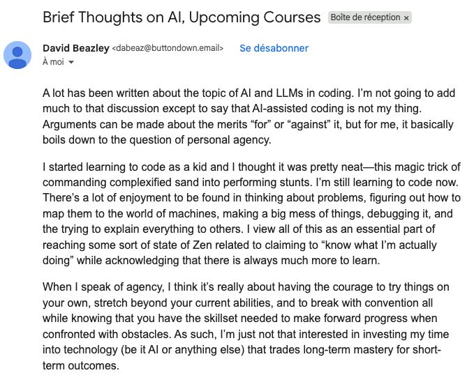

+++
title = "On agency, abstraction, and AI-assisted coding"
description = "Reflections on AI-assisted coding, personal agency, and why working at higher levels of abstraction doesn't mean losing mastery or understanding."
date = "2025-11-04"

[taxonomies]
categories = ["Blog"]
tags = ["AI", "coding", "abstraction", "mastery"]

[extra]
subtitle = "I still feel like I'm using my brain?"
+++

I saw a screenshot of this email about AI-assisted coding and agency, and it sparked a lot of thoughts for me.

The core argument was that AI-assisted coding trades long-term mastery for short-term outcomes, and that represents a loss of personal agency. Agency, in this framing, means having the courage to struggle through problems on your own, stretch beyond your current abilities, and build the kind of deep understanding that only comes from doing the hard work yourself.

It’s a thoughtful argument, but I don’t experience it that way and wanted to share my perspective.

### The abstraction layer argument

When I see arguments that using AI means you don’t actually know what you’re doing or haven’t built something yourself, I wonder how it maps to previous advances in tooling and technology. To me, AI coding tools feel like another abstraction layer. Just like I don’t need to understand exactly how the file system retrieves data from disk to write meaningful programs, I don’t need to hand-craft every line of code to build something real and useful.

When higher-level languages like Python became popular, some low-level programmers dismissed them as “not real programming” because they abstracted away too much control. When React rose in front-end development, other developers complained that newcomers no longer understood the DOM or how browsers actually work, but those new developers were still building interesting, useful products. The waves of abstraction spark similar anxieties that hiding complexity will erode understanding and craftsmanship.

Even if some people feel that way, many of us recognize that higher-level languages didn’t eliminate the need for problem-solving or understanding. Instead, they shifted where we spend our cognitive energy and allowed us to do more by building on top of the existing technology.

I understand that calling AI “an abstraction layer” might be a bit of a stretch. But I still think of it similarly. With AI assistance, I’m learning to orchestrate multiple tools, debug unexpected behavior, and think through architecture in ways I couldn’t before. I’m learning about different frameworks I hadn’t previously explored. The thinking hasn’t disappeared, as far as I’m concerned; it’s just operating at a different level. And, I’m actually able to ship the things that used to live only in my head.

### Where agency actually lives

One of my friends won’t use AI to draft Slack messages because he wants his words to genuinely come from him. It’s important to him that his reasoning process be fully his own.

I get that, but also... not. When I use AI to help articulate an idea, the thinking is still mine. The struggle to figure out what I’m trying to say, the iteration on tone and clarity, the decision about what to include or cut still feels like me.

Beyond that, I’m actually thinking more, not less. Ideas that would have stayed trapped in my head, half-formed and unexplored, now make it out into the world. And once they’re out, I keep iterating on them. I keep expanding, refining, and connecting them to other ideas, and connecting with more people with diverging thoughts. AI is removing the friction that used to stop me from creating things in the first place.

That sense of magic David Beazley describes, of “commanding complexified sand into performing stunts,” hasn’t diminished. If anything, it’s intensified.

### Different tools for different people

I don’t expect to convince anyone who experiences AI assistance as a loss of agency. Different people relate to their craft differently, and that’s completely legitimate.

One thing does bother me about this broader narrative around ownership and mastery, though. I don’t think this is what the author intended, but I dislike the framing that tells people they don’t actually own what they feel they’ve built. When someone uses AI tools to create something they’re genuinely proud of—something they designed, debugged, and shipped—telling them “that doesn’t count” or “you didn’t really build that” feels unnecessarily dismissive. It’s a kind of gatekeeping that decides in advance what “real” mastery looks like and who gets to claim ownership over their work.

I want folks to know that using AI tools doesn’t mean I’m not thinking, not learning, not creating, or not growing. It means I’ve found a set of tools that let me finally build things I’ve been dreaming about for years, and the learning curve is in figuring out *how to work with these tools effectively*, which is its own kind of mastery.

Technology has always been about layering abstractions. Some people prefer working closer to the metal, and others embrace new layers that expand on that. Both approaches have value. Both require agency, courage, and continuous learning.

I don’t feel that mastery disappears when tools evolve, it just evolves with them.

**What’s your experience? Do you find AI tools expand or constrain your sense of agency as a developer?**
