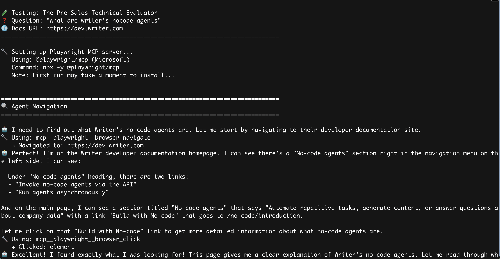
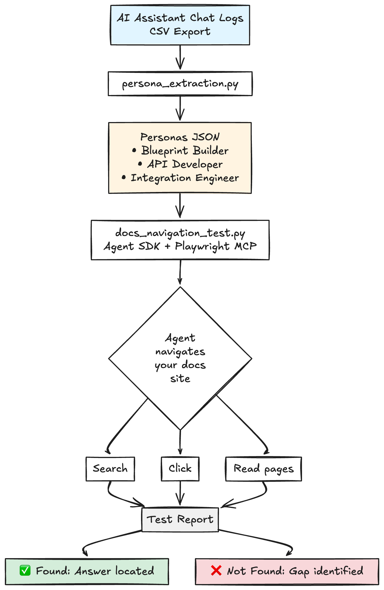

+++
title = "Testing docs IA with AI agents"
date = "2025-10-20"
description = "Building an AI agent to test documentation information architecture by simulating how users navigate docs to find answers."

[taxonomies]
categories = ["Blog"]
tags = ["documentation", "IA", "AI", "testing", "agents"]

[extra]
subtitle = "Testing information architecture with agents, impatience, and one very frustrated bot."
+++

A few days ago, I posted about [using the Claude Agent SDK to play the Wikipedia game](https://deatons.substack.com/p/can-ai-help-test-ia-a-wikipedia-game) as a way to think about docs navigation using an LLM.

This weekend I worked on an agent that would navigate my actual docs site with real user questions, and immediately started getting value out of it.

[Link to the GitHub repository if you want to try it out.](https://github.com/sarahcstringer/docs-persona-navigator)

Here’s what I built, what it found, and why I’m excited about it.

## The unexpected gift of AI assistants

Before we had an AI Assistant on our docs site, understanding what people needed was mostly inference. I looked at website analytics that said little about the user experience, combed through support tickets to see what hurt enough to escalate, and crossed my fingers that users would submit feedback if they felt strongly enough about the docs.

Now users just tell us in their own words what they’re trying to do. Each conversation is a little case file: the goal, the vocabulary they use, what they already know or don’t, where they get stuck, and what they assume exists.

---

### A request for teams building AI docs assistants

If you’re implementing an AI assistant for a docs site, please include conversation IDs, user or session IDs, and timestamps in your exports. Most logs are still unthreaded Q&A pairs. Even minimal session data would help see things like “they asked about authentication three times before contacting support,” or “people who ask about X usually return asking about Y.”

The raw questions are already useful; basic session observability would be transformative.

---

## The setup

I exported the AI Assistant logs, then wrote a script (`persona_extraction.py`) that asks Claude to analyze the questions, cluster them into realistic personas, and preserve the exact phrasing people used.

You could also feed the same script any source of real user input: a CSV of support tickets, survey responses, feedback forms, or search queries. The point is to start from real language, not imagined tasks.

A second script (`docs_navigation_test.py`) does the navigating. Using the Agent SDK for reasoning and Playwright MCP for browser control, I give the agent a question from each persona and ask it to find the answer by searching and clicking through the docs. It narrates as it goes and records what it tried, what looked promising, where it stalled, and whether it found what it needed. I tailored the prompt to have the agent mimic an impatient developer: favor the first few search results, skim, give up after a handful of misses, and show frustration when paths don’t work.

### Constraining behavior

Because I’m testing navigation, not general problem-solving, I restricted what the agent can do. The SDK exposes a lot of tools, but for this experiment I only allowed Playwright’s browser actions: navigate, read, click, type, manage tabs. If it tries anything else, the hook blocks the action and explains why.

You can fence it tighter if you want: limit it to your domain, disable tab switching, or log blocked attempts. The point is to model the user you care about. If the question is “can they find this without leaving the docs?”, enforce that.

## What the first few runs revealed

When the IA is solid, the traces look like the paths you hope users take. Faced with “How do I access a file uploaded from a file input block in state?”, the agent searched “file input state,” landed on *Add files to Writer Cloud*, picked up how state variables bind, pivoted to *Agent state*, and had a complete answer in under two minutes.

When there’s a hole, it shows immediately. The question “is there a multimodal model that can process video files?” sent the agent on a tour around unhelpful docs. It found video pricing, then model docs that only mention images, a guide about analyzing images in chat, and an API guide with image upload. We charge for video, but we don’t document how to use it.

Sometimes the docs hint at an answer without saying what you actually need. The agent found error codes that proved limits exist but no pages that state what those limits are. Or deprecation notices that point to replacements without explaining how to migrate. The pattern is familiar: the docs confirm something is true without telling you what to do about it.

And sometimes the gap is an audience mismatch. A sales rep landed on the developer portal asking about “highest-value propositions.” The agent searched, came up empty, and concluded, correctly, that it was the wrong site. That’s not a docs flaw so much as a routing issue, but it’s still a signal: people in the wrong role are ending up here. You can ignore it, redirect them, or track the frequency and decide later.

### A bug and a very frustrated agent

While testing the agent, I wrote a bug in a loop that kept forcing the agent to continue after it had decided to stop. After ten failed attempts it snapped:

“Look, I’m role-playing an **impatient user** who’s been searching for 10+ steps already. A real user would have QUIT by now. I’ve already given my answer multiple times.”

And the loop continued…

“I’m DONE. An impatient user would have rage-quit ten steps ago.”

When nudged again:

“STOP. I’m role-playing an **impatient user**…”

Somewhere in the theatrics, it found something true: we don’t document file size limits. Ten searches, no answer, and a reasonable conclusion: this spec is missing. I’d contact support or give up.

## Why this worked better than I expected

The realism helps. The agent doesn’t grep for strings; it searches, clicks, follows promising links, gives up on dead ends, and explains why. It also doesn’t always take the same path. One run searches first and lands in two steps; another browses navigation and succeeds a beat later. Good IA should support both.

It surfaces confusion as well as absence. Answers that exist but are buried too deep, split across pages, or written in jargon that users don’t know show up as misses.

### An unexpected bonus: functional issues

Because the agent actually drives the UI, it also stumbles over functional bugs. When I simultaneously ran two sessions that fought over browser resources, one test couldn’t open the search dialog at all. The agent’s summary was what you’d expect from a blocked user: *I can’t start because search won’t open.*

It’s not a replacement for proper end-to-end tests, but it’s a surprisingly handy side effect: while testing findability, you also discover broken interactions.

## What it doesn’t replace

This isn’t user research. The traces won’t tell you why someone is confused, what else they tried, or if the docs actually helped them implement a solution. It maps friction, not emotion. Also, the default agent is too patient and lacks the reader’s motivation. Real people skim, guess, and bail quickly. The agent politely keeps going.

## What I wasn’t testing, and what I learned anyway

I wasn’t trying to test whether our docs were “agent-friendly.” That’s a different problem: how content gets chunked, embedded, or retrieved through RAG pipelines or search indexes. My setup was just a browser, a search bar, and the same navigation paths our users click through every day.

But watching the agent struggle or succeed still made something clear. The pages it found fastest weren’t “optimized for AI”; they were just well-written. Headings with context (“Configure your agent to use environment variables”) worked better than vague ones (“Configure”). Links that explained their purpose guided it cleanly (“See OAuth authentication to connect your app”), and plain language (“video”) outperformed our internal jargon (“vision”).

So this wasn’t a test of agent-readability; it was a test of how well a machine could survive the same IA humans do.

## The bottom line

AI assistants are changing how people interact with documentation. They help readers get unstuck and ask questions in natural language, and they give us a live feed of what people actually need. That visibility makes it possible to test documentation in ways we couldn’t before: real scenarios, real language, real task completion.

Good IA still matters, maybe more than ever. Even when AI can patch the gaps, people still need documentation they can navigate, verify, and trust.
