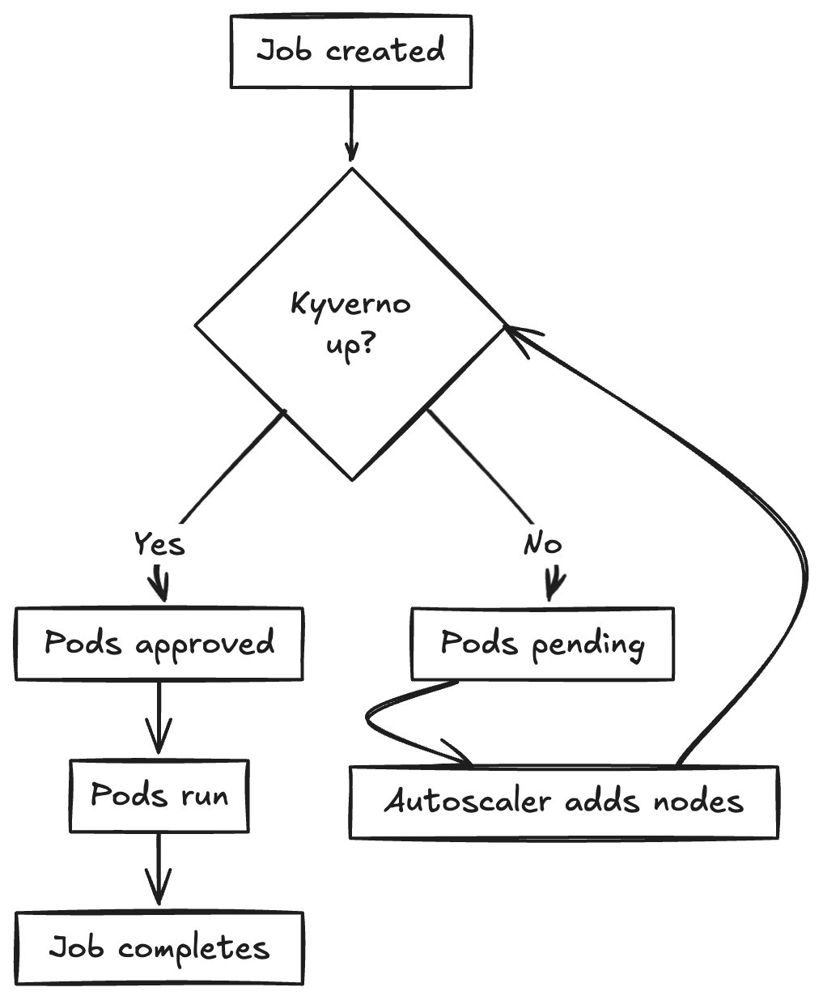

+++
title = "We all fall down: notes from an ordinary outage"
description = "On loops, priorities, and the fragility of complex systems."
date = "2025-09-06"

[taxonomies]
categories = ["Blog"]
tags = ["infrastructure", "kubernetes", "outages", "SRE"]
+++

I love incidents. They’re like mini soap operas, tech stacks buckling under ordinary circumstances for unpredictable reasons, cascading failures, humans rushing to figure out what happened. So normal and each time so unexpected.

It’s been a while since I worked in SRE and have gotten to see a good incident up close. So when a friend who works in infra at a streaming company told me about one particular outage, I wanted to dig into the details and learn more. A regular video processing job kicked off and suddenly the whole cluster was stuck for five days.

It’s the kind of story that reminds me how the internet actually works: not as a gleaming futuristic system, but as a patchwork quilt of duct tape, YAML, and unfinished TODOs.

Here’s my retelling, my best effort as an outsider through persistent questions.

---

## Sidebar: what even is Kubernetes?

This story’s main character is Kubernetes. I’ve had the great fortune to not have to deal with Kubernetes (a.k.a “k8s”) directly. For those like me, here’s my best take on it: it’s like a manager for your apps. Instead of one person running one program on one computer, Kubernetes spreads workloads across many computers, makes sure things restart if they crash, and helps scale up when traffic spikes. It’s kind of like an orchestra conductor making sure dozens of instruments stay in sync, except the instruments are apps, and they sometimes set themselves on fire.

---

## How it started

One of the teams at my friend’s company submitted a large video processing job for routine batch encoding work. These kinds of jobs fan out into tens of thousands of pods: little containers that encode video segments in parallel. There was nothing different about this job except that it was a bit bigger than usual.

But then things jammed. The first clue came when their API gateway started refusing requests with mysterious error codes. Behind the scenes, Kubernetes was taking longer than 60 seconds to answer any kind of question, even one like “hey, what pods are running right now?”

That delay alone was enough to break things, because their cloud provider gives up commands after 60 seconds. So from the outside as a user, the whole system looked frozen. Someone would try to kick off a new job, notice it wasn’t running, try to query what was going on, and nothing would happen.

---

## Sidebar: pods in plain English

Pods are the smallest “work unit” in Kubernetes. Imagine every task you want to run, like “encode this 30-second clip,” gets its own little container. That’s a pod. They’re disposable, lightweight, and meant to come and go constantly. Pods help things run in parallel and keep discrete workloads isolated.

---

## Slack pings and silent dashboards

This part of the infra team doesn’t rely heavily on alerts. Most of their workloads are batch encoding jobs, which should retry and recover automatically. The first notice of something wrong came in Slack with messages like:

- “Hey, the encoding job isn’t finishing…”

- “Is the processing cluster down?”

- “The batch queue seems stuck”

So the infra team went to the dashboards. But, nothing looked wrong.

## The metrics that lied

Everything seemed fine when they went to look at the metrics. That’s when they remembered that their monitoring system, Prometheus, was configured to “assume everything’s fine” for 30 minutes if it stopped hearing from a service.

If something died, Prometheus just kept reporting its last known state for 30 minutes, rather than showing that the service had entirely stopped sending metrics. To the dashboard, it looked like video encoding was proceeding normally. To the humans, it meant they had no actual insight into what or where things were breaking as the batch processing queue backed up.

This was a known issue with their monitoring system, but it turns out that the engineer who started fixing it had left for another job, and the half-complete system stayed behind, quietly misleading everyone.

## The missing gatekeeper

Eventually, after lots of digging, they discovered the real culprit: Kyverno, the “gatekeeper” service that approves or rejects new pods, had vanished.

It hadn’t crashed. It’s not that it just had to spin up again. It had been evicted entirely.

Why? Because another service from the security team had been given higher priority than even critical system services. So when resources got tight, Kubernetes politely kicked Kyverno out to make room.

In this case, the security team hadn’t coordinated with the infra team when they set that priority. Infra assumed it was just another workload, not something that could outrank the cluster’s most essential services.

Imagine a bouncer who has to check every person before they can enter the club getting kicked out when the club gets busy by someone shouting “FOR SECURITY REASONS.”

No Kyverno means no new pods, including Kyverno itself.

## The long slog

Part of the reason this outage dragged on was that Kyverno itself hadn’t been set up with any safety nets. Only one copy was running instead of multiple replicas because no one had updated the default setting from `replicas: 1`. If there had been replicas, there could have been another copy of Kyverno available to let in the evicted one. And, there were no rules in place to prevent it from being kicked out.

So when Kubernetes needed to free up space and Kyverno went away, with it went the entire cluster’s ability to process encoding jobs.

Not having done Kubernetes work myself, I wondered why they couldn’t just delete the problematic jobs that started this mess. Well, apparently the jobs weren’t just sitting in the queue. They were part of Kubernetes’ Job and Pod system, which is designed to retry until success.

If you delete one, the Job controller notices: “Oh, that pod disappeared, but the job isn’t done yet” and it immediately schedules a new one. And in this outage, the admission controller was down, which meant nothing new could start anyway, so trying to “clean up” jobs didn’t help. They’d just boomerang back or stay pending, still clogging the scheduler’s brain.

## The recovery

The only way out was drastic: delete the admission rules that required Kyverno in the first place. That needed elevated permissions, so another team stepped in to rip out the safety checks temporarily.

Once Kyverno was no longer required, the cluster slowly brought itself back online:

- The setup tasks could run.

- Nodes became ready.

- Kyverno was allowed back.

They restored the admission rules, this time with better safeguards: multiple replicas, disruption budgets, and higher priority.

The encoding pipeline limped back to life, and the batch processing queue finally started clearing.

---

## Sidebar: why removing admission rules is a big deal

Deleting admission rules didn’t sound that dramatic to me – just get rid of a few filters to get things back to normal. But it’s closer to removing the turnstiles at a subway station. Normally, those gates check every passenger’s ticket, which slows things down slightly, but ensures everyone who enters is allowed. Without them, trains move faster at first, but freeloaders and chaos slip in.

That’s what happened here: taking down the rules let the cluster recover, but it also meant anything (good or bad) could sneak through until order was restored.

---

## Lessons

This whole saga was a reminder that:

- Small defaults matter. Forgetting to set “run 3 copies of this critical service” can take down a whole processing pipeline.

- Priorities collide. One team’s well-intentioned security tweak can accidentally evict the very thing keeping the system alive.

- Observability isn’t optional. Dashboards that lie are worse than dashboards that scream.

- Complex systems fail in loops. Once you get stuck in a cycle (“can’t start A without B, can’t start B without A”), recovery often requires outside help.

## In the end

What I loved about this outage was that it had less to do with machines failing and more to do with humans being human. Someone left a job and left their half-finished monitoring fix behind. Someone else set a priority without checking what it might evict. Someone forgot to configure replicas. All perfectly reasonable decisions in isolation.

It was a reminder that our digital world runs on millions of these small choices, most of them invisible until suddenly brought under the microscope of a blameless postmortem.

The miracle isn't that things break. It's that they hold together as often as they do. Most of the time, our duct tape and YAML and forgotten TODOs somehow keep the lights on. Until they don't.

---

1. When they’re not actively happening to me and I didn’t cause them by dropping a column in the production database.
